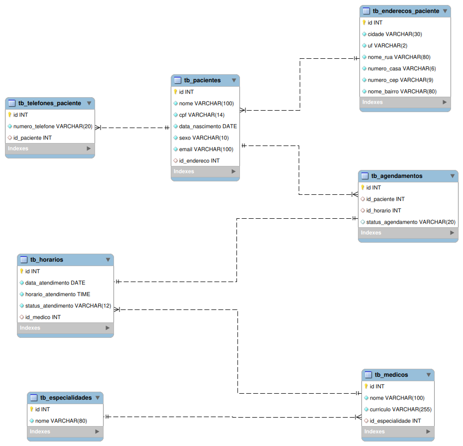

# Projeto Final - Sistema de Clínica Médica (Banco de Dados)

## Descrição Geral do Projeto

Este projeto foi desenvolvido como atividade final da disciplina de Banco de Dados tendo como base a modelagem de um sistema de clínica médica. O banco de dados implementado visa modernizar e otimizar a gestão de dados de agendamentos, desde o cadastro de especialidades e médicos até o registro de consultas para pacientes.

A infraestrutura foi construída utilizando **PostgreSQL** para o banco de dados e **pgAdmin** para a administração via interface gráfica. O ambiente foi totalmente conteinerizado com **Docker Compose**, visando garantir a portabilidade e a criação de um ambiente de desenvolvimento consistente e de fácil execução.

O principal objetivo do projeto é fornecer uma modelagem estrutural eficiente e íntegra para o gerenciamento de clínicas médicas, facilitando o acesso seguro à informação.

---

## Diagrama ER


---

## O Que Desenvolvemos

Nossa equipe criou toda a estrutura relacional para a gestão de agendamentos médicos utilizando **PostgreSQL**. O banco de dados foi projetado para otimizar a rotina de armazenamento de uma clínica, garantindo:

* **Cadastro Estruturado:** Tabelas otimizadas para gerenciar especialidades, médicos e pacientes de forma organizada.
* **Agendamento Consistente:** Estrutura que permite registrar consultas de forma eficiente e rastreável.
* **Histórico e Relatórios:** Base sólida que permite realizar consultas complexas para gerar relatórios e estatísticas.

---

## Por Que o Banco de Dados é Essencial

A escolha do **PostgreSQL** como nosso Sistema de Gerenciamento de Banco de Dados (SGBD) foi fundamental para garantir o funcionamento do sistema cumprindo requisitos importantes, como:

* **Dados Relacionados:** Pacientes possuem múltiplos agendamentos, médicos são associados a especialidades e horários específicos.
* **Consistência:** Evitamos informações incorretas com o uso de constraints (regras) bem definidas.
* **Acesso e Segurança:** Garantimos a integridade referencial. Implementamos recursos como chaves primárias e estrangeiras para garantir que operações como "remover um médico do sistema" ou "apagar um paciente" mantenham os dados atualizados de forma consistente, sendo impedidas de acontecer caso violem tais regras.

---

## Tecnologias Escolhidas

* **Banco de Dados:** `PostgreSQL` - Escolhido por sua altíssima robustez, conformidade com padrões SQL e recursos avançados.
* **Administração:** `pgAdmin 4` - Interface gráfica web completa e intuitiva para gerenciar o servidor Postgres.
* **Containerização:** `Docker` e `Docker Compose` - Facilitam a implantação, execução e orquestração dos serviços em qualquer máquina sem necessidade de instalações locais complexas.

---

## Resultado

O resultado final é uma modelagem de banco de dados funcional e segura, que demonstra como a estruturação correta da informação pode simplificar processos complexos. O esquema atual oferece uma base robusta para o gerenciamento de agendamentos, pronta para ser integrada a futuras aplicações (APIs ou sistemas web).


## Como executar o projeto

### 📋 Pré-requisitos

Para executar este projeto, você precisará ter instalado em sua máquina:
* [Git](https://git-scm.com/);
* [Docker](https://www.docker.com/) e Docker Compose

---

### Como Executar

Siga o passo a passo abaixo para rodar a infraestrutura do banco de dados.

#### 1. Clonar o Repositório

```bash
git clone [https://github.com/dev-jefferson-matheus-ifrn/clinica_bd.git](https://github.com/dev-jefferson-matheus-ifrn/clinica_bd.git)
cd clinica_bd
```

#### 2. Iniciar a Infraestrutura (Docker)

Na raiz do projeto (onde está o arquivo `docker-compose.yml`), execute o comando abaixo para iniciar os serviços do banco de dados (PostgreSQL) e do gerenciador (pgAdmin):

```bash
docker compose up -d
```
*(O parâmetro `-d` roda os containers em segundo plano)*

#### 3. Acessar o pgAdmin

Com os containers rodando, abra o seu navegador e acesse a interface do pgAdmin:

* **URL:** [http://localhost:5050](http://localhost:5050)
* **Email Address:** `me@example.com`
* **Password:** `1234567`

#### 4. Configurar a Conexão com o Servidor PostgreSQL

Como o pgAdmin está rodando dentro do Docker, ele se comunica com o banco através da rede interna dos containers. Para conectar, usaremos o IP direto do container do banco de dados. Siga os passos:

1. No terminal, execute o comando abaixo para descobrir o IP interno do banco de dados:
```bash
docker inspect -f '{{range .NetworkSettings.Networks}}{{.IPAddress}}{{end}}' dev-postgresql
```
2. No painel esquerdo do pgAdmin, clique com o botão direito em **Servers** > **Register** > **Server...**
3. Na aba **General**, digite um nome para o servidor (Ex: `Clínica Médica DB`).
4. Vá para a aba **Connection** e preencha da seguinte forma:
   * **Host name/address:** *[Cole aqui o IP que foi retornado no comando do passo 1]*
   * **Port:** `5432` *(Porta interna padrão do Postgres)*
   * **Maintenance database:** `mydatabase`
   * **Username:** `postgres`
   * **Password:** `1234567`
5. Marque a opção **Save password?** se desejar e clique em **Save**.

Pronto! Seu banco de dados está rodando e conectado com sucesso. Agora você pode executar seus scripts de criação de tabelas e inserção de dados pelo pgAdmin.